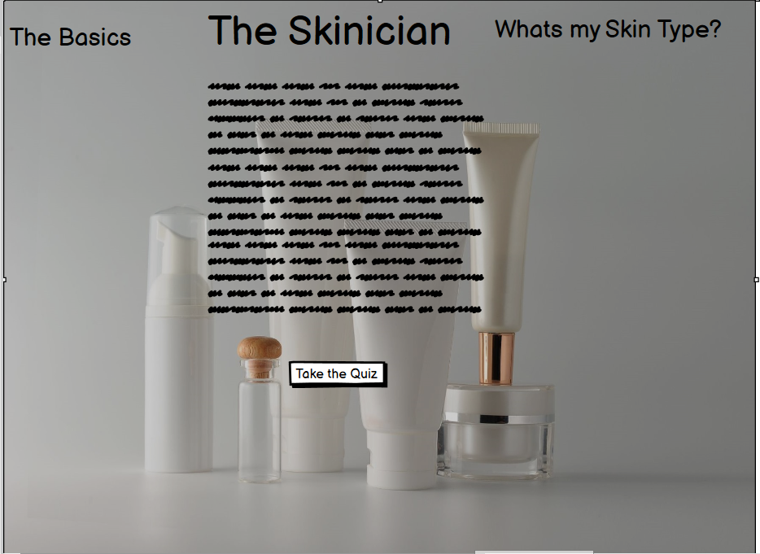

# The Skinician
## Introduction
Welcome to The Skinician, the aim of this site is to educate users about skincare, particularly their own skincare. After a brief introduction 
about the site, users will be asked to complete a small questionaire in relation to their own skin care issues, their answers will the lead them 
to both a highend and drugstore product that will suit their needs and hopefully their budget also.
## Motivation
I chose this as my Milestone 2 Project because it relates to my own professional background as a beauty therapist, from my own experience, 
skincare is something that can confuse many people. There are thousands of products available, a lot of which are not necessary along with many using
the incorrect products for their skin types/ conditions which in some cases can make these conditions worse.
## Future Planning 
This site gives the basic skincare products for the most common skin conditions/issues. More products can be added and the site itself can be 
expanded to include extra products, hair products, makeup products and many more. There could also be an option for salons to incorporate this
into their marketing to include their own retail products.

----------------- 
## User Stories (UX)
### Wireframes
- Mobile  

- Tablet  

- Desktop  

### User Experiences 
- First Time User- 
As a first time visitor to the site, the primary goal would be education. What is the site? What does it do? How would it benefit me?
These questions will be answered on the homepage of the site allowing users to educate themselves on the skincare basics.

- Returning User- 
Returning visitors will most likely want to find out their own skintype and the products they will need to suit their budget.

- Frequent Visitors-  
Frequent visitors will want access to the product information they will need to suit them, skincare is an expensive investment and it many
not be possible to buy all the products they want all at once, as such it would be nice to have somewhere to access the information when they need it.

